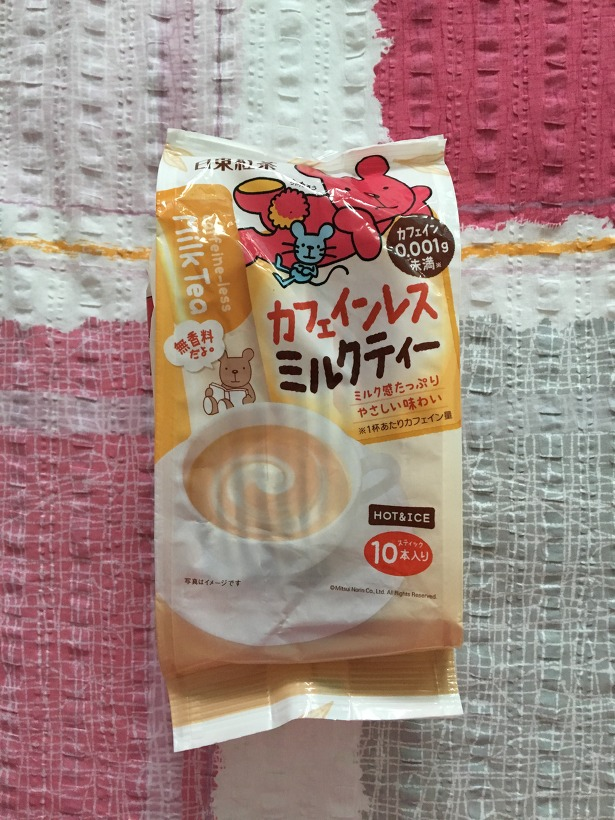

# 일본 밀크티
 
## pokka sapporo ロイヤルミルクティー (250g)  

[포카 삿포로 로얄밀크티]  
'부드러운 감칠맛 휴식의 향기 / 실론 찻잎 사용'  
110円 (1,210원)  
이건 달고 묽다.  
데자와랑 비슷한데 그것보단 아주 조금 더 진한 편.

-----------------

## Lipton 白の贅沢 ミルクティー (280g)
[립톤 흰색 사치 밀크티]
130円 (1,4230원)
'ミルクティー' 이게 '미루쿠티', 그러니까 '밀크티'다.
로이야루미루쿠티, 즉 로얄밀크티.
단맛은 그리 강하지 않으나
목 넘어갈 때 쓴 맛이 나고 비리다.
두 번은 안 사먹을 맛이다.
불호.
-----------------
  
## AGF Blendy stick 紅茶ラテ (10개입)
ラテ를 라테라고 읽는다. 라떼다.
레시피대로 하면 너무 연하고
딱 레시피 2배로 진하게 타먹으면 입에는 쏠쏠히 맞는데
공차 당도 70 느낌이다.
------------------

## カフェインレス ミルクティー (10개입)
[caffeine-less milk tea]
Blendy stick 홍차라떼가 더 맛있다.
하나만 타도 무진장 달다.
홍차 맛은 별로 안 난다.
------------------

## 오후의 홍차 캔
2200원
학교 생협 매점에서 판매한다.
데자와 정도로 묽고 달다.
------------------

## 오후의 홍차 페트병
3천원대.
일본 여행 다녀오신 분이 선물해주셨다.
